## ComputerGraphics_Lab2
# Translation Matrix
I implement this matrix to do the translation.  
([1 0 0 tx]  
 [0 1 0 ty]  
 [0 0 1 tz]  
 [0 0 0 1 ])  

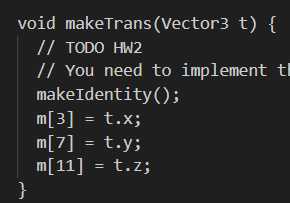
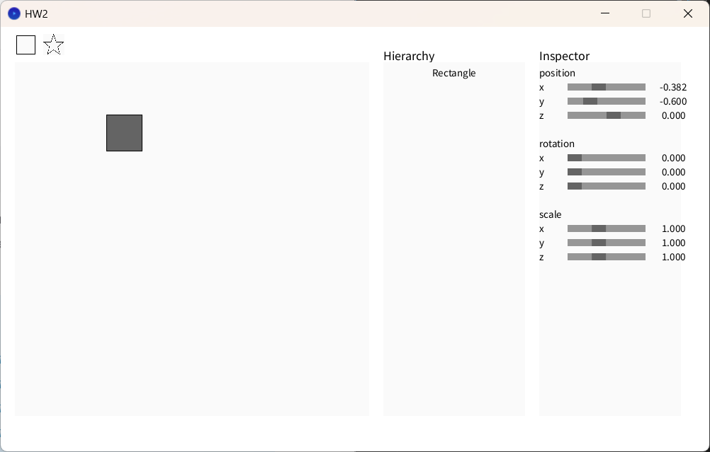
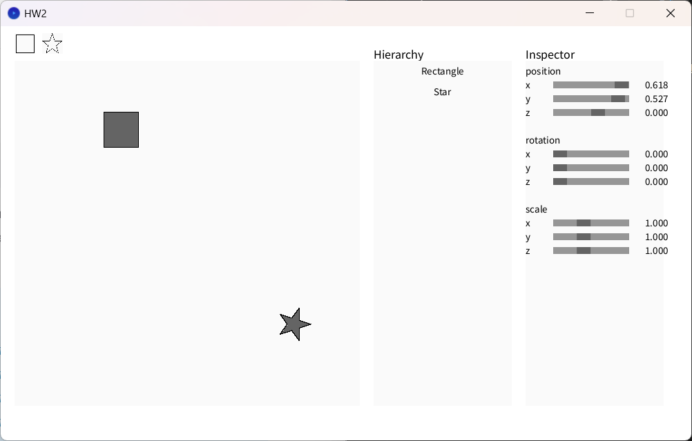

# Rotation Matrix
I implement this matrix to do the rotation.  
([cos(a) -sin(a) 0 0]  
 [sin(a)  cos(a) 0 0]  
 [ 0        0    1 0]  
 [ 0        0    0 1])  

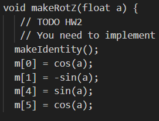
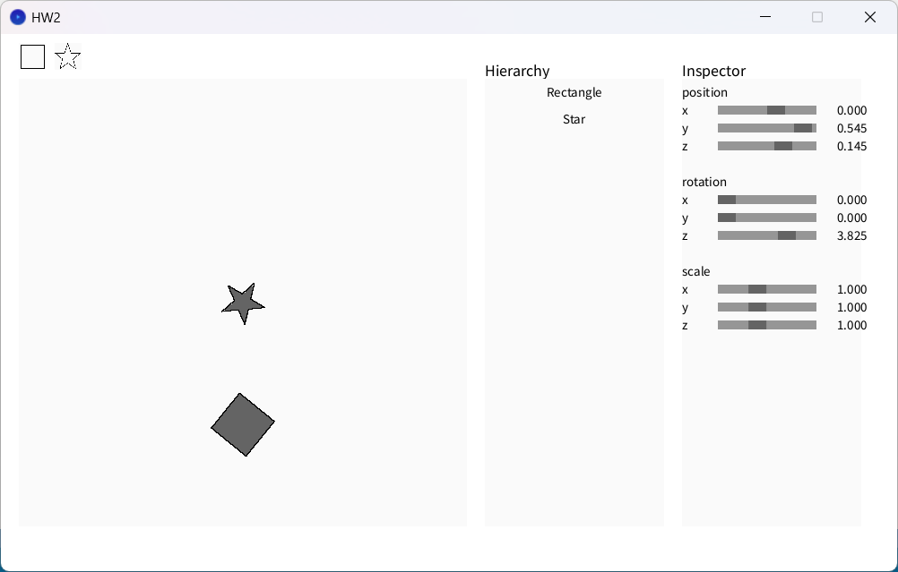

# Scaling Matrix
I implement this matrix to do the scaling.  
([sx 0  0  0]  
 [0  sy 0  0]  
 [0  0  sz 0]  
 [0  0  0  1])  

 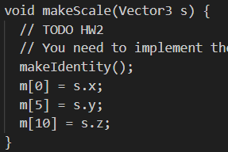  
 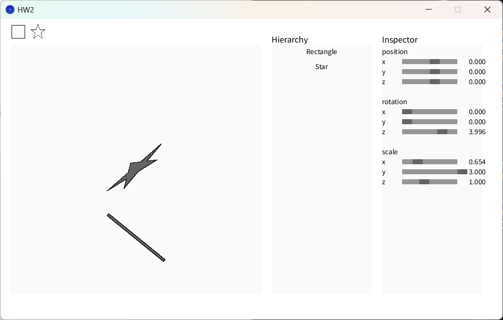  

# Is the point inside a shape?
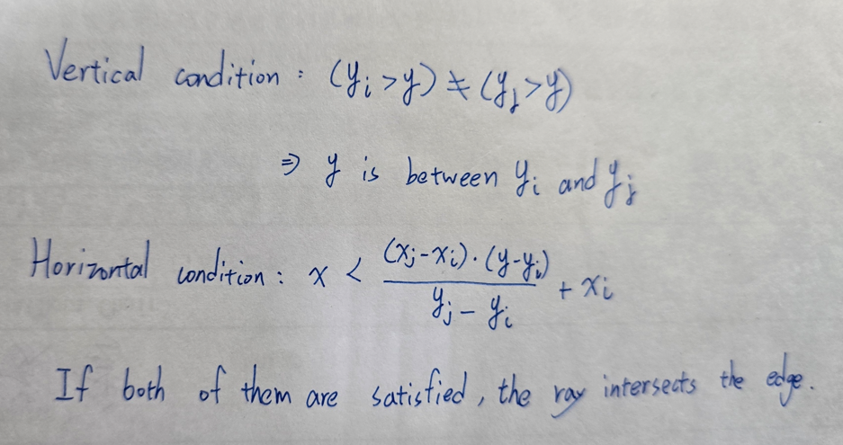  
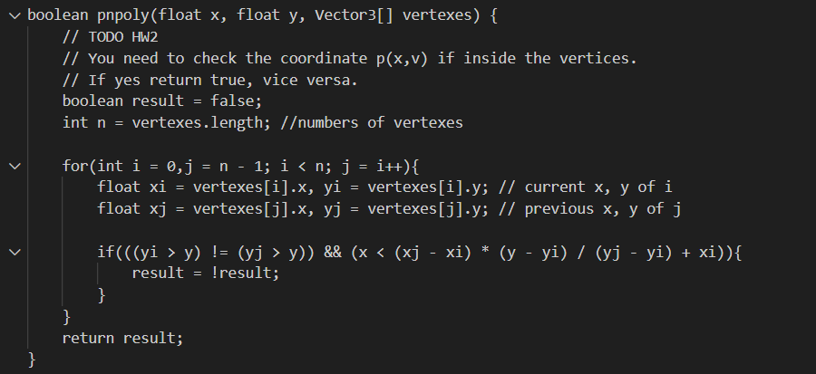  
(The polygon is already filled with color)  

# Find the boundary of a polygon
I traverse the vertices and update the minimum and maximum coordinates of the bounding box.   
I initial the minimum as Float.MAX_VALUE and initial the maximum as Float.MIN_VALUE.  

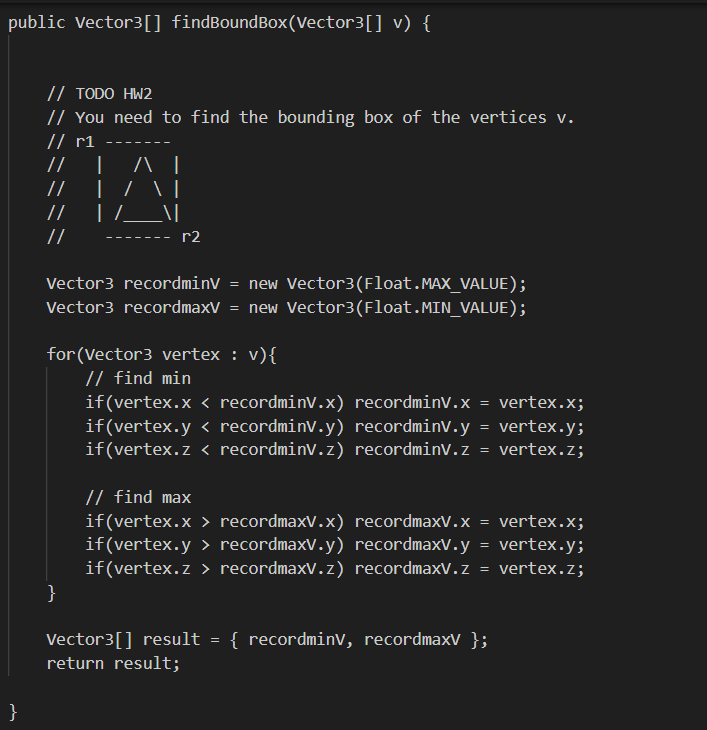

# Keep the polygon inside the canvas
I implement Sutherland hodgman Algorithm.  
I put the previous vertex in P and current vertex in Q.  
And then traverse all of the vertexes.  
I handle each P and Q pair based on whether they are inside or outside the boundary.  
1. Both Inside: If both P and Q are inside, Q will be added to output.  
2. Outside to Inside: If P is outside and Q is inside, the intersection point between P and Q with the edge is computed and added to output, and the added Q.  
3. Inside to Outside: If P is inside and Q is outside, the intersection point is added to output.  
4. Both Outside: If both are outside, no points are added.  
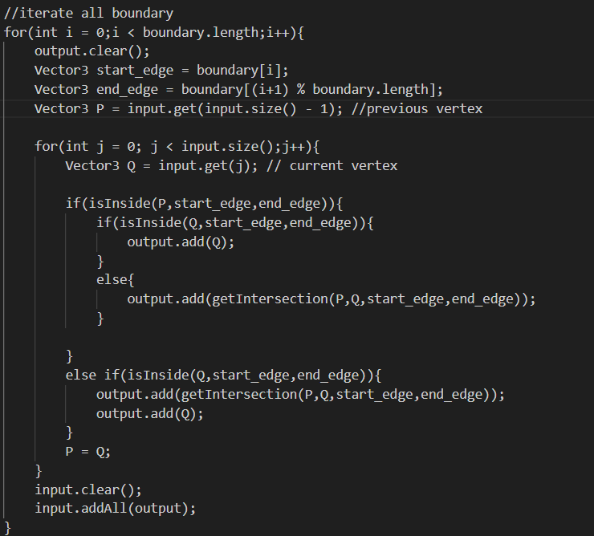

**isInside function**  
(end.x - start.x) and (end.y - start.y) define the direction vector from start to end.  
(p.x - start.x) and (p.y - start.y) define the direction vector from start to p.  
The use cross product to determine inside or outside.  
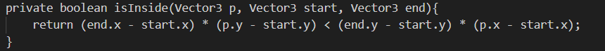

**getIntersection function**  
I use this function to find the intersection point of two line.  
Line equation of two point (x1,y1) and (x2,y2)：  
    a * x + b * y =c where  
    a = y2 - y1, b = x1 - x2, c = a * x1 + b * y1  
Then calculate the determinant:  
    det = a1 * b2 - a2 * b1  
Then use Cramer's formula to find the intersection point.  
    x = (b2 * c1 - b1 * c2) / det  
    y = (a1 * c2 - a2 * c1) / det  

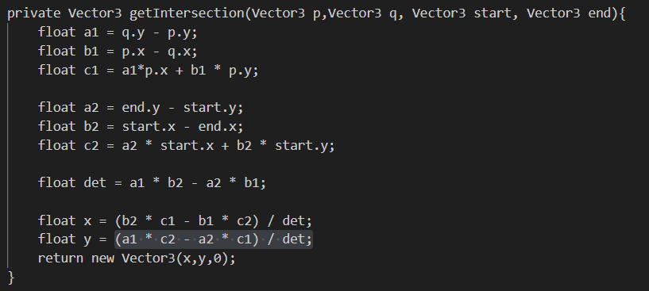
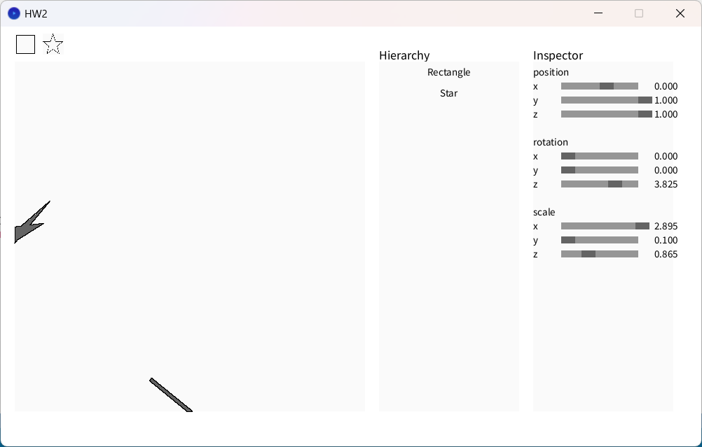
This task was quite hard.I use ChatGPT to help me doing this task.But the code from ChatGPT cannot be run directly so I adjust some part and ask questions to my classmate to help me complete this task.

